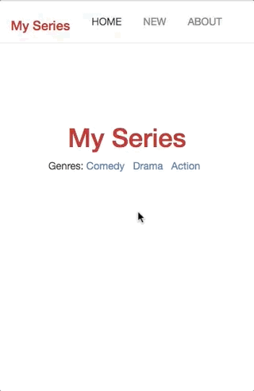

# React Flix =)
> I created this application, in order to apply what I studied with react.

With this application, you can use "CRUD" in react, the intent is, manage yours favorite series =)



## Installation

OS X & Linux:

```sh
yarn install or npm install
```

You can run server with
```sh
yarn start or npm start
```

## Development setup

To simulate how api works, you will need ```json-server```, you can get [here](https://github.com/typicode/json-server)
then run
```sh
json-server --watch db.json --port 3001
```

